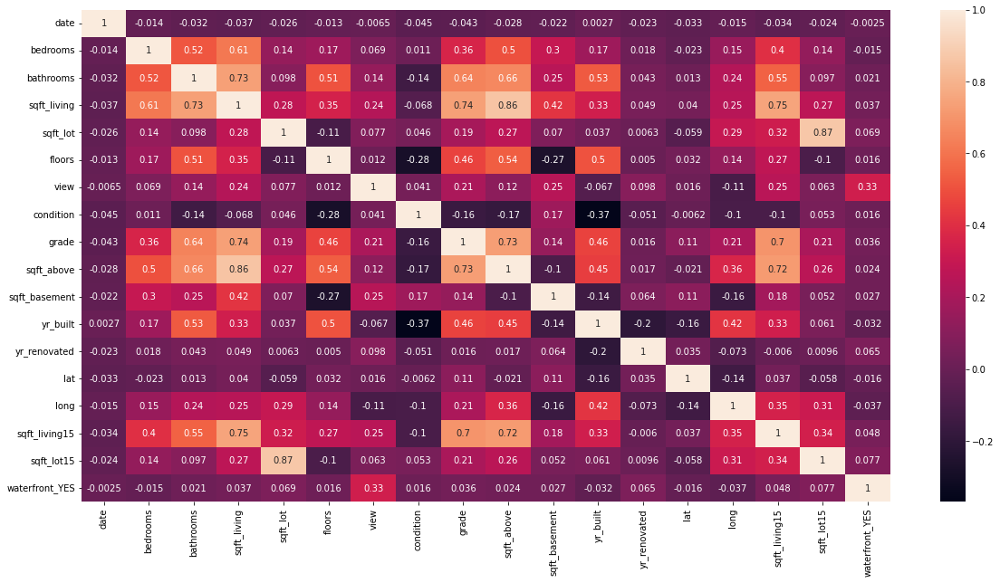
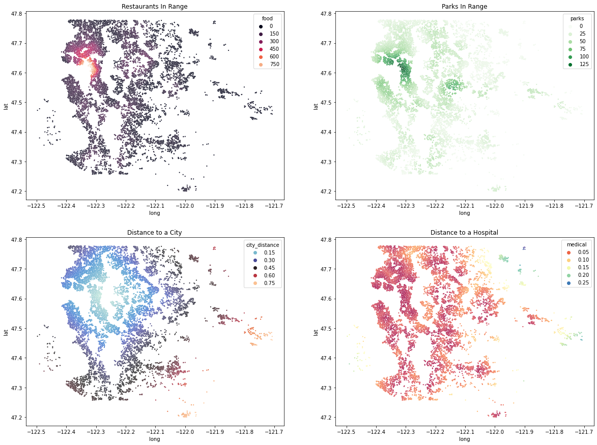
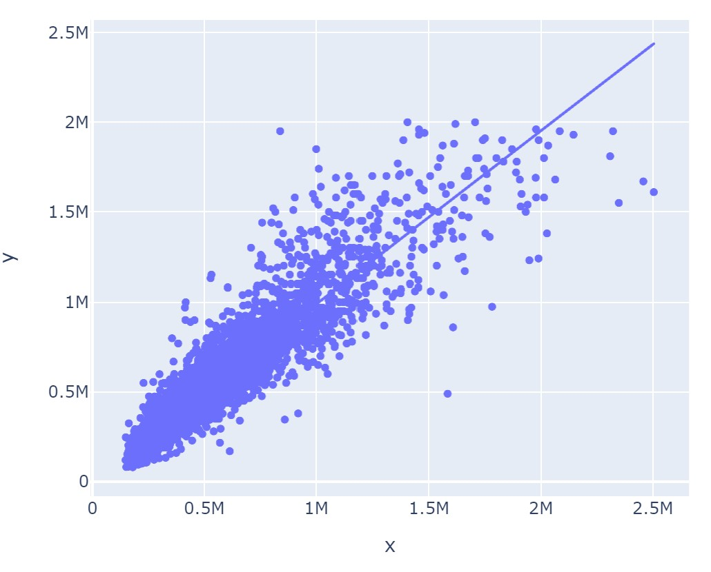

# Housing Market
#### By John Harrigan

## Overview
By looking at the information for over 20,000 homes in King County WA, it is possible to narrow down the specific factors that have the greatest impact on market price for your average house. Anyone in the business of flipping houses can use this analysis to help choose the right kind of house, and the best renovations, to boost their profits as much as possible

## Business Problem

This project is designed to help out anyone in the business of flipping houses in the name of profit. Any such business needs to have accurrate data that will tell them the areas of the most undervalued houses, and will tell them the most profitable renovations to be made to those houses. They want to know a specific plan of action for finding, buying, renovating, and selling the homes with the most potential for profit.

## Data
There is an open source website gis called "King County Open Data Gis" that contains information on over 20,000 homes. This dataset contains everything about the price, dimensions, location, and condition of each property. It also has countless datasets about everything else in King County from aiports to police stations. I took in the datasets for parks, restaurants, hospitals, and major cities. I used these additional datasets to add more locational data to each house record.

## Methods
I started out by cleaning the data and getting rid of outliers that could affect my analysis models. I then used several multiple regression models to see how much each independent variable affected the price of the home. The baseline regression model was just the numeric data for each home checked against the price which had a MAE, RMSE, and rsquared of: 113185, 176049, 0.685 respectively.

For the first full model I converted the categorical variables into numeric types and included all the available data into the next multiple regression model. This model had a MAE, RMSE, and rsquared of: 67965, 109649, 0.872 respectively. For the second full model I used a heatmap to check the correlations between my independent variables. This would allow me to check for mulitcollinearity.

From this map I decieded to drop the sqft above and basement so that I could simplify my model by just keeping the total sqft of the house represented as 'sqft_living'. I chose to exclude the zipcode columns from the heatmap because I wanted to keep any location relation data in the model because the location in general is the most important factor in house price.

For the third full model I wanted to add a little more about the location of each house so I added in information about each houses proximity to major cities, parks, restaurants, and hospitals in the area.

I also attempted to use a PolynomialFeature method to check all of the interactions between variables. After this I went through the hundreds of interactions and kept the indiviudal ones that had the most impact on the accuracy of the model

## Results
The most influential factors proved to be the locational variables. If the house was on the water or it had a view, the sale price shot up by up to 50% of the sales prices of similar houses with no view or water access. From my modeling I first chose the range of house prices to look for based on my models predictions of the testing data.

Based on my model's predictions I chose the range of $300,000 - $1,200,000. Any lower and the business would lose out on profit, any higher and my model would not be reliably accurate. Based on this price range, I chose the five zipcodes that were the most undervalued by my model.

## Conclusions
Based on the coefficients of my model, a house flipping business would want a house:
- **On or around the beach**
- **In one of the five zipcodes**
- **With an unobstructed view of the water or some other sight**
- **that has plenty of space to expand the house**
- **As close to the city as possible

## Next Steps
- I would want a larger dataset of houses to bolster the accuracy of the model
- More recent data 
- I would conduct a seperate analysis for the affects of COVID on the housing market
- I might need a dataset for the school districts to incorporate into the model
- Other transportational data such as highway access, trains, busses stops, airports, etc.

